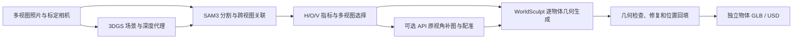

# SceneGen

从多视图照片重建场景、分割物体、选择视角、生成独立 Mesh，再放回原场景坐标并导出 GLB / Isaac Sim USD 的实验流程。

从 Extended-GS 的 `scene_gen` 工作区整理而来。主要几何后端是 **WorldSculpt 多视图生成**；保留 SAM 3D 单视图高斯生成、混合背景和 TSDF 等历史对照入口。

> 当前是研究原型。此前 room 实验导出了 66 个物体，但仍有缺面、碎片和主体断裂；闭合拓扑不等于完整物体，静态碰撞配置也不等于动态仿真验证。[已知问题与修复方向](docs/KNOWN_LIMITATIONS.zh-CN.md)

## 流程



默认物体场景不包含 3DGS 背景或重建房间网格。3DGS 用于选视角、深度代理和定位；USD 额外包含不可见的地面碰撞支撑。

## 代码入口

| 阶段 | 入口 |
| --- | --- |
| SfM / 3DGS | `examples/preprocess/run_hloc_sfm.py`、`examples/extended_trainer.py` |
| SAM3 与物体关联 | `full_scene_inventory.py`、`track_full_scene_objects.py` |
| 热力图与视角排序 | `examples/segmentation/generate_instance_views.py` |
| 免费额度 API 补图 | `scripts/complete_multiview_api.py`、`scripts/complete_full_object_views.py` |
| 多视图物体生成 | `examples/segmentation/generate_worldsculpt_objects.py` |
| 轮廓检查与网格修复 | `inspect_full_scene_objects.py`、`select_and_repair_full_objects.py` |
| 缺面 / 碎片诊断 | `examples/mesh/audit_object_completeness.py` |
| 回填及 GLB / USD | `examples/mesh/assemble_full_object_scene.py` |
| Isaac 打开与检查 | `scripts/open_scene_isaac.py`、`scripts/validate_full_object_scene_isaac.py` |

未写目录的分割入口位于 `examples/segmentation/`，网格选择入口位于 `examples/mesh/`。算法脚本保留原路径，避免破坏已有文件契约。

## 安装与开始

```bash
git clone --recurse-submodules https://github.com/NorwegianSmokedSalmon/SceneGen.git
cd SceneGen
bash scripts/setup_scene_gen.sh
conda run -n scene_gen python scripts/download_scene_gen_models.py --model sam3
```

当前安装配方针对已验证的 Linux、RTX 5090 32 GB、CUDA 13.0、Python 3.12、PyTorch 2.10。其他硬件需匹配 Torch/CUDA 与编译架构。[完整环境说明](docs/SCENE_GEN_SETUP.zh-CN.md)

准备室内样例的 3DGS、分割与真实物体视图：

```bash
conda run -n scene_gen python scripts/download_indoor_scene.py --scenes room
SCENE_RUN_3D=0 bash scripts/run_scene_gen_indoor.sh
```

这一步复用历史 room 家具实例选择 `0 1 2`；换数据或聚类结果变化时需先检查实例编号。多视图生成、全场景关联和导出按[分阶段说明](docs/WORKFLOW.zh-CN.md)执行。66 物体实验含人工实例审核和按物体重试，尚不是适用于任意场景的一键完整重建器。

安装物体几何环境：

```bash
bash scripts/setup_scene_gen_3d.sh
bash scripts/setup_scene_gen_worldsculpt.sh
.cache/scene_gen/envs/worldsculpt/bin/python -m pip install -r requirements-scene-gen-simulation.txt
```

可选 API 凭据：

```bash
cp .env.example .env
# 在本地 .env 填写 MODELSCOPE_API_TOKEN
```

API 客户端使用 ModelScope 或公开 Hugging Face 演示，不自动切换付费服务。免费额度和可用性由服务商决定；单张补图配准通过不代表跨视角几何一致。

## 查看已导出的场景

在**已安装 Isaac Sim 的独立环境**中运行（本文用 `scene_gen_isaac` 作为环境名）：

```bash
LD_LIBRARY_PATH= conda run --no-capture-output -n scene_gen_isaac python scripts/open_scene_isaac.py   --scene results/scene_gen_room/full_objects/scene/scene.usda
```

仓库只包含源码、配置与文档；数据、模型、`.env`、Conda 环境、生成 GLB/USD 和运行缓存均不提交。首次克隆没有上述生成结果，需要先生成或自行放入。

## 检查与文档

```bash
python scripts/check_source_tree.py
LD_LIBRARY_PATH= conda run -n scene_gen_3d python -m unittest discover -s tests -p 'test_scene_gen_geometry.py'
```

- [阶段命令与输入输出契约](docs/WORKFLOW.zh-CN.md)
- [全场景物体实验记录](docs/SCENE_GEN_FULL_OBJECTS.zh-CN.md)
- [API / 多视图对照记录](docs/SCENE_GEN_API_COMPARISON.zh-CN.md)
- [几何完整性限制](docs/KNOWN_LIMITATIONS.zh-CN.md)
- [整理与验证说明](docs/PUBLISHING_NOTES.zh-CN.md)
- [上游来源和许可证](THIRD_PARTY.md)

保留来源仓库的 Apache-2.0 LICENSE；第三方子目录、下载的权重和数据遵循各自许可证。`gsplat/` 是所需的渲染后端，其原包名和引用信息保留。
